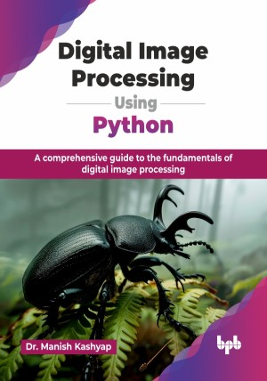

# Digital Image Processing Using Python

A comprehensive guide to the fundamentals of digital image processing.

This is the repository for [Digital Image Processing Using Python
](https://bpbonline.com/products/digital-image-processing-using-python?variant=44402854887624),published by BPB Publications.

## About the Book
“Digital Image Processing Using Python" offers a comprehensive guide to mastering image processing techniques through practical Python implementations. It equips you with the essential tools and knowledge to manipulate, analyze, and transform digital images using the powerful programming language, Python.

This book offers a comprehensive exploration of digital image processing, combining theoretical foundations with practical applications. Starting with fundamental concepts like image representation and pixel neighborhoods, the book teaches Python programming and essential libraries for image manipulation. It covers a wide range of techniques, including spatial and frequency domain filtering, non-linear processing, noise reduction, wavelet transforms, and binary morphology. Advanced topics such as phase-based processing, multi-resolution analysis, and morphological operations are also explored in depth. The book provides practical examples and exercises to reinforce learning and equip readers with the skills needed to effectively process and analyze digital images for various applications. 

By integrating Python code with visual examples, you will gain practical experience and insights that are directly applicable to your work. This approach ensures that you not only learn theoretical concepts but also understand how to implement them effectively in real-world situations.

## What You Will Learn
• Implement image processing techniques using Python libraries and tools.

• Understand core concepts like filtering, segmentation, and enhancement.

• Apply practical Python code to real-world image processing tasks.

• Develop skills to analyze and manipulate digital images effectively.

• Create and visualize image processing algorithms with hands-on examples.
